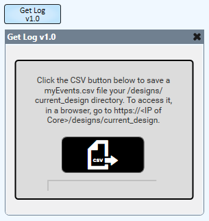

# Q-SYS Event Log Exporter

This is a very simple plugin that allows you to export your Core's Event Log to a .CSV file.

Click [here](https://qsc0-my.sharepoint.com/:f:/g/personal/maxx_sanner_qsc_com/EqLXnrwzZG1MmRnixxPLPvQBCriWMxxtNAJANus4nGf_Gw?e=qRSlX0) to download the plugin.

## How to Use

* Simply download the plugin and add it to your C:\Users\< user >\Documents\QSC\Q-Sys Designer\Plugins folder. 
* Drag into your schematic from the plugins section of your Schematic Elements. 
* Simply click the CSV button and this will save a myEvents.csv file to your Core's /designs/current_design directory. To access it, simply open a browser and navigate to https://< core IP >/designs/current_design. 

## How it Works

This plugin uses the HttpClient library to pull timezone and event log data from your Core using a loopback IP. Timezone data is pulled to ensure the exported event log's event times match the event times in the Event Log in your Core. It then writes the data in a CSV format to a .csv file that is saved to the /designs/current_design directory of your Core using the io.write() method.

## Badges 
 
 

## Questions 
 For any questions, contact me at [maxxsanner105@gmail.com](mailto:maxxsanner105@gmail.com).
#### 

